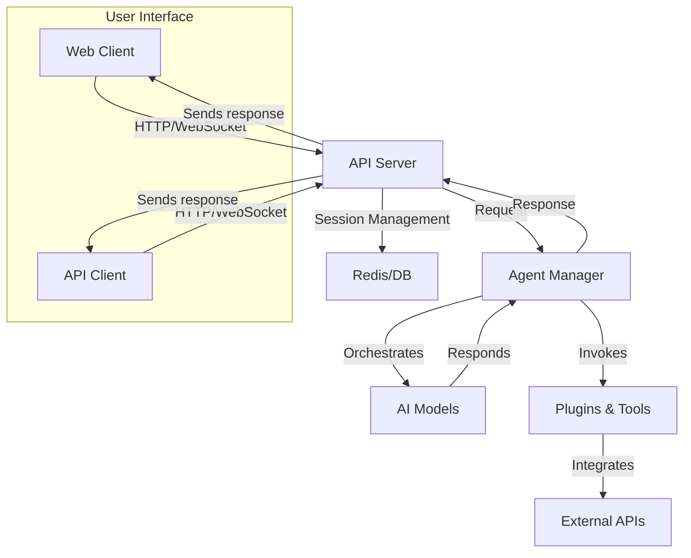

# Alaris Project

## Introduction

The Alaris Project is a modular, scalable, and extensible platform designed for advanced AI-driven applications. It integrates multiple AI models, APIs, and tools to deliver conversational AI, information retrieval, and automation capabilities. The project emphasizes flexibility, supporting custom workflows, easy integration of new modules, and real-time communication with various services.

## Features

- Modular architecture for easy feature extension
- Multi-model AI orchestration and intelligent agent workflows
- Real-time streaming response support
- Flexible plugin system for custom tools and APIs
- Natural language understanding and context management
- Built-in authentication, authorization, and session management
- Logging, analytics, and error tracking
- Support for various deployment environments (cloud, local, containerized)

## Requirements

- Node.js (version 18.x or higher)
- npm or yarn for package management
- Docker (optional, for containerized deployment)
- Supported AI API keys (e.g., OpenAI, Anthropic)
- Redis or other supported database (for session and state management)
- Modern browser (for frontend interface, if included)

## Usage

To use the Alaris Project, clone the repository and install dependencies. Configure environment variables for API keys and services. Start the server to interact with the platform via HTTP API, WebSocket, or the web interface.

Example workflow:
- Start the backend server.
- Connect via REST API or WebSocket.
- Send a message or command to an agent.
- Receive AI-generated responses, which may leverage external tools or plugins.

## Installation

Follow these steps to install and run the Alaris Project:

1. Clone the repository:
    ```bash
    git clone https://github.com/Ashwin522/Alaris-Project.git
    cd Alaris-Project
    ```

2. Install dependencies:
    ```bash
    npm install
    # or
    yarn install
    ```

3. Copy and edit environment configuration:
    ```bash
    cp .env.example .env
    # Edit .env to add API keys and desired settings
    ```

4. (Optional) Start supporting services (e.g., Redis, database):
    ```bash
    docker-compose up -d
    ```

5. Start the application:
    ```bash
    npm run start
    # or
    yarn start
    ```

6. Access the API or frontend:
    - API: `http://localhost:3000/api`
    - Web Interface: `http://localhost:3000/` (if frontend is included)

## Configuration

Alaris Project uses environment variables to manage configuration. Key options include:

- `PORT`: Server port (default: 3000)
- `OPENAI_API_KEY`: API key for OpenAI integration
- `ANTHROPIC_API_KEY`: API key for Anthropic integration
- `DATABASE_URL`: Database connection string
- `REDIS_URL`: Redis connection string
- `LOG_LEVEL`: Logging verbosity

Edit the `.env` file to customize these settings. You can also configure available agents, plugins, and tool integrations by editing the appropriate JSON or TypeScript files in the `config` or `src` directories.

## Architecture Overview

The platform uses a modular design centered on agents, tools, and workflows. The following diagram illustrates the main components and their interactions:



## Extending and Customizing

- **Add new agents**: Define agent logic in the `agents` folder and register in the configuration.
- **Integrate new tools/plugins**: Add modules to the `tools` or `plugins` directory.
- **Customize workflows**: Modify orchestrator logic for advanced routing or multi-step processing.
- **Change frontend**: Edit UI components (if present) in the `ui` or `frontend` folder.

## Support and Contribution

Contributions are welcome! Please fork the repository, create a new branch, and submit a pull request. For issues or feature requests, use the issue tracker on GitHub.

---

For more detailed documentation, check the `/docs` directory or visit the project's wiki (if available).
